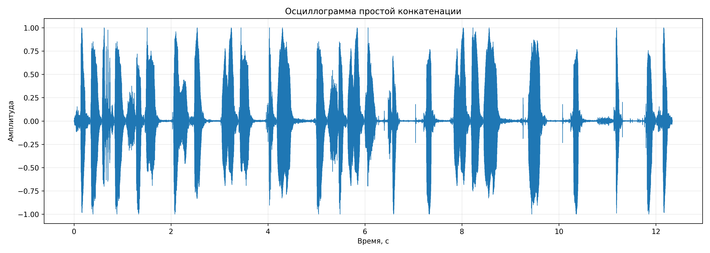
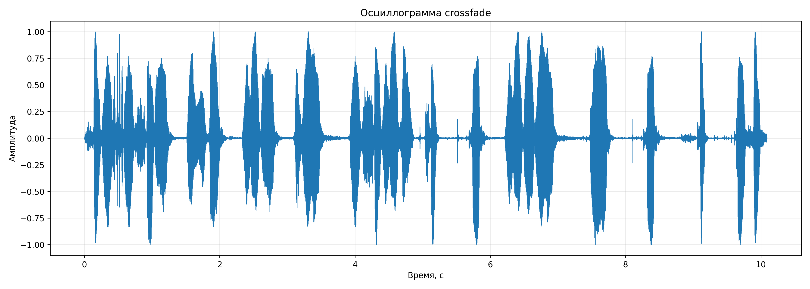
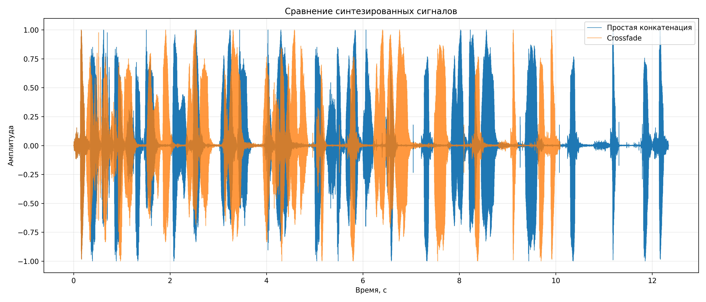
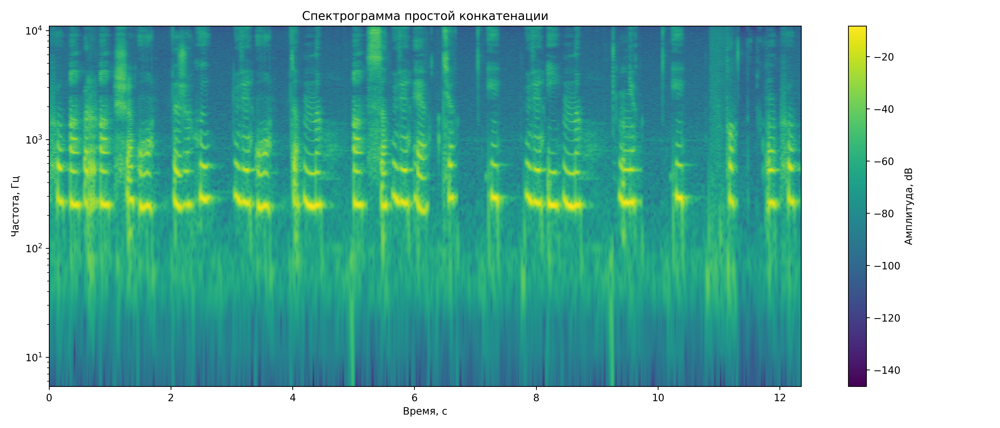
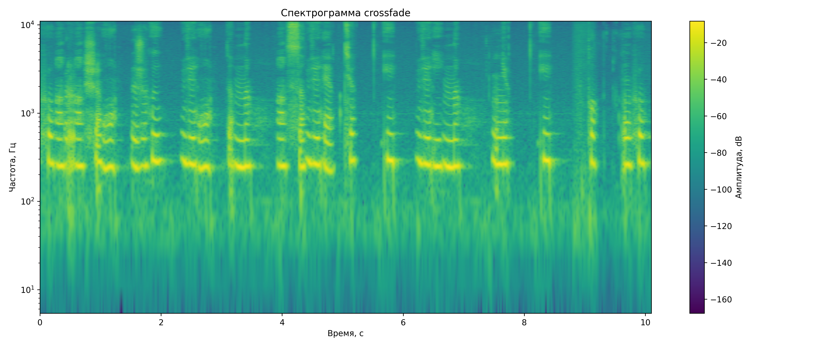

# Лабораторная работа №10
# Обработка голоса
## Вариант 2 — Синтезатор речи


## Исходные данные

| Параметр | Значение |
|---|---:|
| Формат аудио | WAV, mono |
| Частота дискретизации | 22050 Гц |
| Количество фонем и аллофонов | 62 |
| Длительность crossfade | 90 мс |
| Порог удаления тишины | 28 dB |
| Синтезируемая фраза | Хорошо живёт на свете Винни-Пух |

---


## Фонетическая цепочка

```text
h-a_red-r-a_red-sh-o-zh-y_mid-v_soft-o-t-n-a_red-s-v_soft-e-t_soft-i_red-v_soft-i-n-n_soft-i_red-p-u-h
```

---

## Полученные аудиофайлы

| Метод | Файл | Длительность |
|---|---|---:|
| Простая конкатенация | `results/simple_concat.wav` | 12.343 с |
| Crossfade | `results/crossfade_concat.wav` | 10.094 с |

---

## Осциллограмма простой конкатенации



---

## Осциллограмма crossfade



---

## Сравнение сигналов



---

## Спектрограмма простой конкатенации



---

## Спектрограмма crossfade



---

## Сравнение методов

| Метод | Преимущества | Недостатки |
|---|---|---|
| Простая конкатенация | Простой алгоритм, высокая скорость | На границах фонем могут быть слышны паузы и щелчки |
| Crossfade | Плавные переходы, меньше слышимых стыков | Требуется дополнительная обработка сигнала |

---

## Вывод

В ходе лабораторной работы был реализован синтезатор речи на основе записанных фонем и аллофонов русского языка. Фраза «Хорошо живёт на свете Винни-Пух» была синтезирована двумя способами: простой конкатенацией и методом crossfade.

После добавления удаления тишины, нормализации и плавного затухания пробелы между фонемами стали менее заметными. Наиболее качественный результат получен при использовании crossfade, так как он обеспечивает более плавные переходы между соседними звуковыми фрагментами.
